# **The Internet Of Things** 

## and capturing 

# **Time Series Data**

<small>Marco Pas / Philips Research</small>

---

## Goal

Learn how to **CONNECT** IoT devices,  
**COLLECT** and **VISUALIZE** Time Series Data.

---

## Agenda

+ The **Internet Of Things**

+ How to **connect** your Things

+ **Getting data** from your Things

+ **Visualize the data** from your Things

---

# The **Internet of Things**

Small Things, Big Things and Stupid Things

----

## Definition

> The **network of physical devices** 
> and **connectivity** which enables these 
> objects to connect and **exchange data**

Notes:
Where to find them? Kitchen, Car, Phone, Pets, Cows,  Smartphones, Ovens, Pacemakers, Bicycles, Thermometers, ...

----

## Typical IoT Device

<div class="multiCol">
    <div class="col">
        <ul>
            **Software**
            <li>Applications</li>
            <li>Connectivity</li>
            <li>Operating System</li>
        </ul>
    </div>
    <div class="col">
        <ul>
            **Hardware**
            <li>Device itself</li>
            <li>Sensors</li>
            <li>Connectivity modules</li>
        </ul>
    </div>
</div>

 <!-- .element height="40%" width="40%" -->


----

## Some **remarkable** examples

<div class="multiCol">
    <div class="col">
        <ul>
            <li>Smart diapers</li>
            <li>Water bottles</li>
            <li>Egg minder</li>
            <li>Connected Spoons</li>
            <li>Toilet rings</li>
            <li>Wearable rings</li>
            <li>Toasters</li>
        </ul>
    </div>
    <div class="col">
        
    </div>
</div>
----

## Some **cool** examples

----
<!-- .slide: data-background="./images/iot-device-hue.jpg" -->
## Ambient Experience

<div class="multiCol" style="color:white">
    <div class="col">
        <ul>
            <li>Smart Home</li>
        </ul>
    </div>
</div>

----
<!-- .slide: data-background="./images/iot-device-wearables.jpg" -->

## Wearables

<div class="multiCol" style="color:white">
    <div class="col">
        <ul>
            <li>Health Monitoring</li>
        </ul>
    </div>
    <div class="col">
        <ul>
            <li>Assistive Technology</li>
        </ul>
    </div>
</div>

----
<!-- .slide: data-background="./images/iot-device-smart-pharming.jpg"-->

## <div style="color:black;">Smart Farming</div>

<div class="multiCol" style="color:black">
    <div class="col">
        <ul>
            <li>Precision Farming</li>
        </ul>
    </div>
    <div class="col">
        <ul>
            <li>Livestock Monitoring</li>
        </ul>
    </div>
</div>

----
<!-- .slide: data-background="rgb(181, 83, 60)" -->

## IOT is hard <i class="fas fa-exclamation-triangle"></i> 

> IoT Projects have a 75% Failure Rate

+ Long completion times
+ Poor quality of the data collected
+ IoT integration
+ Budget overruns
+ Data privacy / Security

----
<!-- .slide: data-background="rgb(181, 83, 60)" -->


Note: Fisher-Price smart bear allowed hacking of children's biographical data.

----
<!-- .slide: data-background="rgb(181, 83, 60)" -->
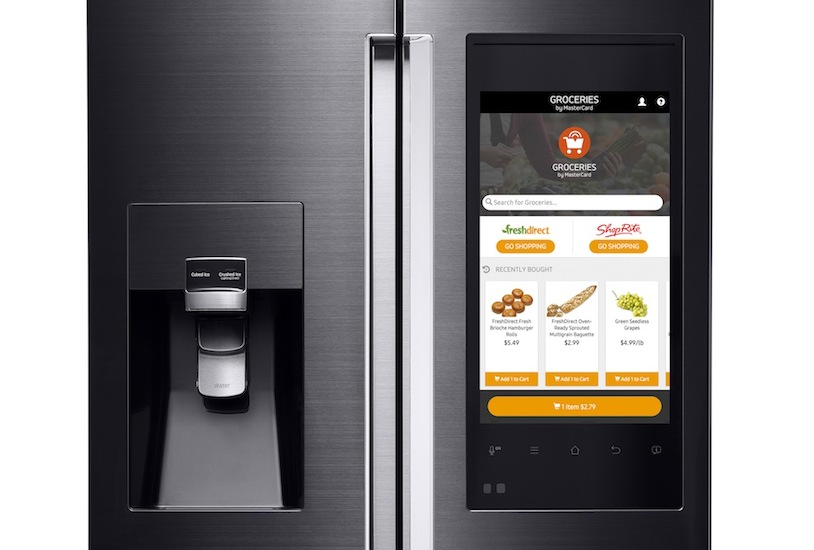

Note: Samsung had a smart fridge that didn’t check SSL certificates, which meant someone could use a man-in-the-middle attack to snag your Google login information.

----
<!-- .slide: data-background="rgb(181, 83, 60)" -->


Note: A hack in October of 2016 used IoT devices to shut down massive portions of the internet, the victim was a company called Dyn, which is one of the entities that route web traffic.

----
<i class="fas fa-exclamation-triangle fa-2x"></i>

When you start playing around with IOT devices do not forget about **security and data privacy**.

---

# How to **connect** Your Things

Natively & using AWS IOT

----

## Connectivity Requirements

+ **Lightweight** and Bandwidth Efficient
+ **Simple** to implement
+ **Data Agnostic**
+ Continuous **Session Awareness**
+ Support **Quality of Service**

----

## Connectivity Candidates

<i class="fas fa-tablet fa-2x"></i>  <i class="fas fa-arrows-alt-h fa-2x"></i> <i class="fas fa-cloud fa-2x"></i> <i class="fas fa-arrows-alt-h fa-2x"></i> <i class="fas fa-server fa-2x"></i>

+ REST/GRPC
+ AMQP
+ XMPP
+ STOMP
+ **MQTT**
+ CoAP

----

## **MQ** **T**elemetry **T**ransport

> MQTT is a Client Server **publish/subscribe messaging transport protocol**. <br><br> Standardized under OASIS.

Note: Developed out of IBM’s pervasive computing team and their work with partners in the industrial sector.

----

## MQTT Parts

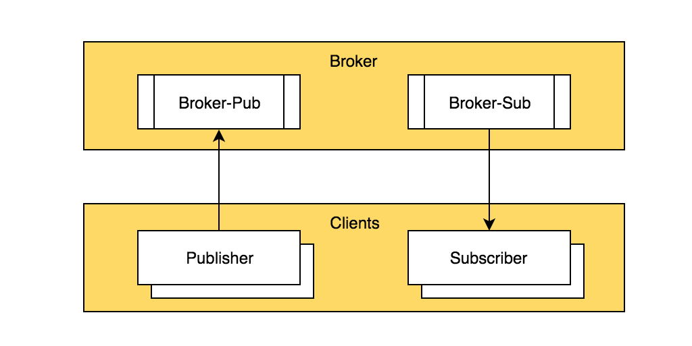 <!-- .element height="90%" width="90%" -->

----

## MQTT Tooling

<div class="multiCol">
    <div class="col">
        <ul>
            <u>Brokers</u>
            <li>**Mosquitto**</li>
            <li>HiveMQ</li>
            <li>ActiveMQ</li>
            <li>RabbitMQ</li>
            <li>emqttd</li>
            <li>**AWS IOT**</li>
            <li>...</li>
        </ul>
    </div>
    <div class="col">
        <ul>
            <u>Clients</u>
            <li>**Paho**</li>
            <li>**Spring Integration**</li>
            <li>...</li>
        </ul>
    </div>
    <div class="col">
        <ul>
            <u>Tools</u>
            <li>MQTT.fx</li>
            <li>MyMQTT</li>
            <li>MQTT Lens</li>
            <li>**MQTTBox**</li>
            <li>...</li>
        </ul>
    </div>
</div>

----

# IoT & MQTT **Natively**

----

##### Demo - Overview

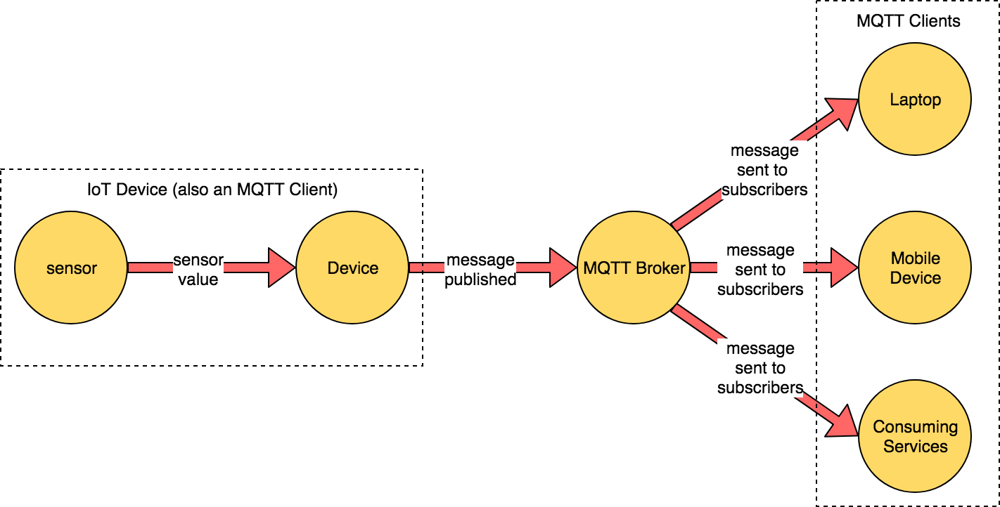

----

##### Demo - **Run broker  & connect client**

  <!--  .element  height="90%"  width="90%"  -->

----

```
// file: docker-compose.yml
version: "3"
services:

  mosquitto:
    image: eclipse-mosquitto:1.4.12
    container_name: mosquitto
    ports:
      - 1883:1883       # MQTT port
      - 9001:9001       # MQTT websocket port
    volumes:
      - $PWD/../../mosquitto/config/mosquitto.conf:/mosquitto/config/mosquitto.conf
      - $PWD/../../mosquitto/data:/mosquitto/data
```

----

## Demo

## **Run broker  & connect client**

----

## MQTT Connect

What                  |                Description
--------------------- | ------------------------------------------
**ClientId**          | Unique identifier of each client
**Username/Password** | Authenticating/Authorization
**Last Will Message** | Notify other clients, when a client disconnects ungracefully

----

## MQTT Connect Example

```java
String clientId = MqttClient.generateClientId();
MqttClient client = new MqttClient("tcp://localhost:1883", clientId);

MqttConnectOptions connOpts = new MqttConnectOptions();
connOpts.setUserName("foo");
connOpts.setPassword("bar");

client.connect(connOpts);
```

----

##### Demo - **Publish & Subscribe**

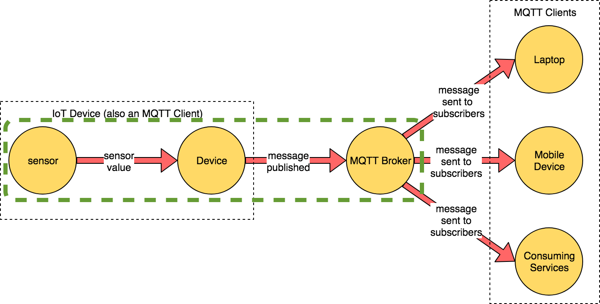  <!--  .element  height="90%"  width="90%"  -->

----

##### Demo - **Publish & Subscribe**

```
// Publish a message
$ mosquitto_pub -t "myhome/livingroom/temperature" -m '0.1' # publish a message
$ mosquitto_pub -t "myhome/livingroom/temperature" -l       # publish by line

// Start a subscriber
$ mosquitto_sub -v -t "myhome/livingroom/temperature"
$ mosquitto_sub -v -t "myhome/+/temperature"                # using + wildcard
$ mosquitto_sub -v -t "myhome/#"                            # using # wildcards
```

----

## Demo

##  **Publish & Subscribe**

----

## MQTT Message

What           |                Description
-------------- | ------------------------------------------
**Payload**    | Data agnostic payload (images, texts, any binary data)
**Topicname**  | A simple string, hierarchically structured
**Retainflag** | Retain last message if no subscribers
**QoS**        | The quality level of this message (0/1/2)

----

## MQTT Publish Example

```java
String clientId = MqttClient.generateClientId();
MqttClient client = new MqttClient("tcp://localhost:1883", clientId);
MqttConnectOptions connOpts = new MqttConnectOptions();
connOpts.setUserName("foo");
connOpts.setPassword("bar");
client.connect(connOpts);

// publish
MqttMessage message = new MqttMessage();
message.setPayload("Hello world from Java".getBytes());
client.publish("iot_data", message);
client.disconnect();
```

----

##### Demo - **SpringBoot/Grails and MQTT**

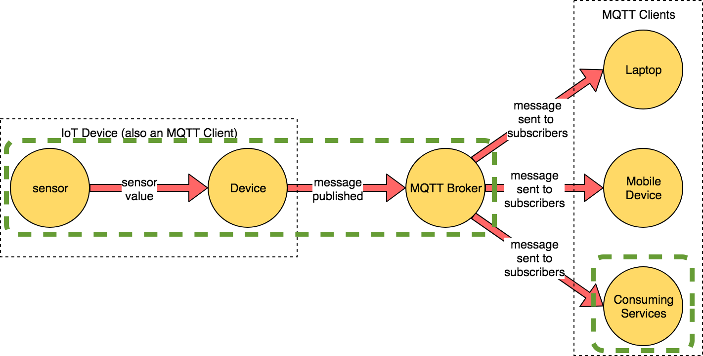  <!--  .element  height="90%"  width="90%"  -->

----

## SpringBoot/Grails and MQTT

It is just as simple as adding dependencies on:

```
// file:build.gradle
compile "org.springframework.boot:spring-boot-starter-integration"
compile "org.springframework.integration:spring-integration-mqtt"
```

----

## Spring Integration and MQTT
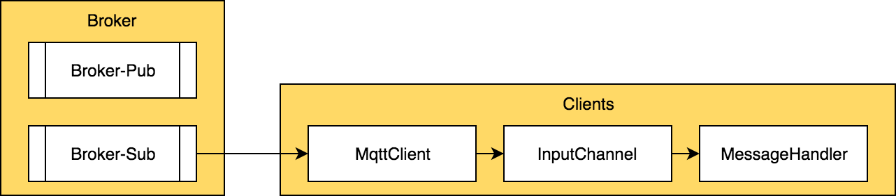  <!--  .element  height="90%"  width="90%"  -->

----

## Mqtt Client
```
// MqttClient
@Bean
DefaultMqttPahoClientFactory mqttClientFactory() {
    DefaultMqttPahoClientFactory factory = new DefaultMqttPahoClientFactory()
    defaultMqttPahoClientFactory.setServerURIs("tcp://localhost:1883")
    return factory
}
```

----

## InputChannel
```
// InputChannel
@Bean
MessageChannel mqttInputChannel() {
    return new DirectChannel()
}

@Bean
MessageProducerSupport mqttInbound() {
    MqttPahoMessageDrivenChannelAdapter adapter = 
        new MqttPahoMessageDrivenChannelAdapter(
            UUID.randomUUID().toString(),
            mqttClientFactory(),
            "myhome/livingroom/temperature"         // subscribe to topic
    );
    // some code intentionally omitted
    adapter.setOutputChannel(mqttInputChannel())    // send to channel
    return adapter
}

```
----

## MessageHandler
```
// MessageHandler
@Bean
@ServiceActivator(inputChannel = "mqttInputChannel")
MessageHandler stringHandler() {
    return new MessageHandler() {
        @Override
        void handleMessage(Message<?> message) throws MessagingException {
            println message.payload.toString()
        }
    }
}
```
----

## Demo

##  **SpringBoot/Grails and MQTT**

----

# Amazon **AWS IoT**

----

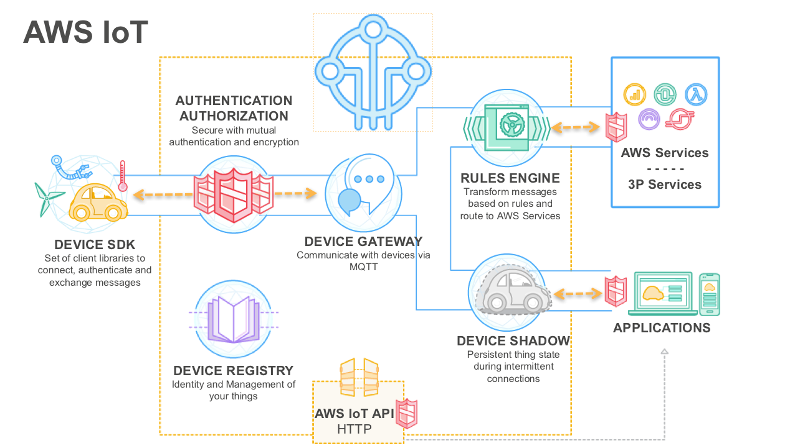  <!--  .element  height="100%"  width="100%"  -->

----

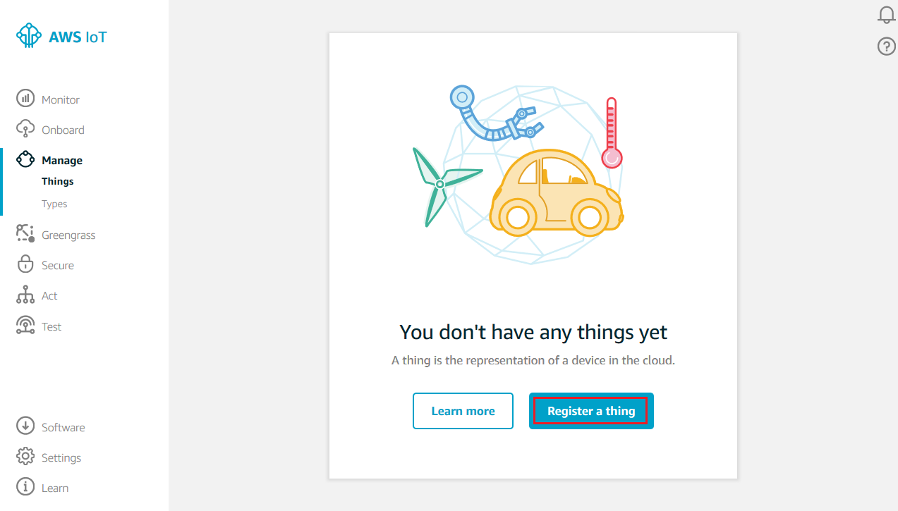  <!--  .element  height="100%"  width="100%"  -->


----

## AWS IoT - Rules

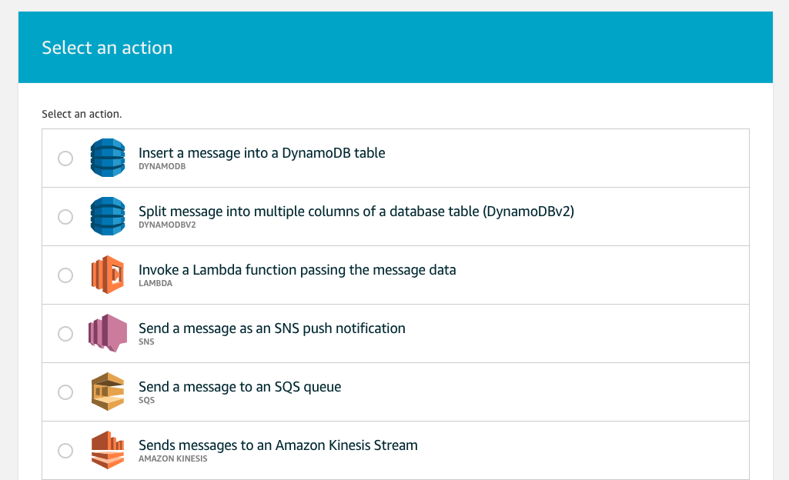  <!--  .element  height="100%"  width="100%"  -->

----

## AWS IoT offerings

* IoT Core
* Device Management
* GreenGrass
* IoT Analytics
* Amazon FreeRTOS
* IoT 1-Click
* IoT Button

----

##### Demo - **AWS IoT - Publish & Subscribe**

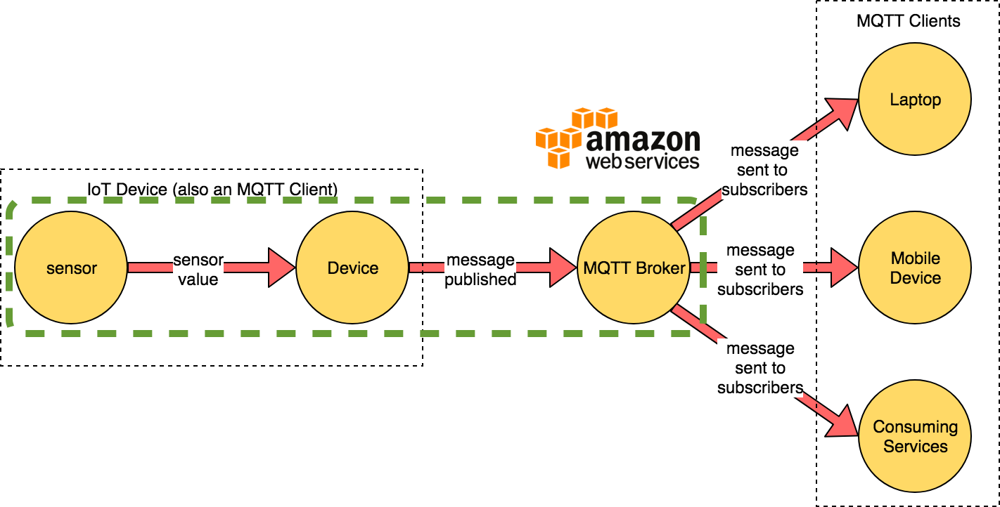  <!--  .element  height="90%"  width="90%"  -->

----

## Connect to AWS IoT

Requirements
* **Register your thing** inside AWS IoT
* Generate certificate for your thing
* Attach policy to the certificate

```json
{
  "Version": "2012-10-17",
  "Statement": [
    {
      "Effect": "Allow",
      "Action": "iot:*",
      "Resource": "arn:aws:iot:<region>:<arnId>:*"
    }
  ]
}
```

----

## AWS IoT - Publish & Subscribe

Publish
```
mosquitto_pub --cafile aws-iot-rootCA.pem --cert <device-certificate>.pem.crt 
  --key <private-key>.pem.key  -h <aws-iot-endpoint> -p 8883 
  -t <topicName> -m "Hello from Mosquitto"
```

Subscribe
```
mosquitto_sub --cafile aws-iot-rootCA.pem --cert <device-certificate>.pem.crt 
  --key <private-key>.pem.key  -h <aws-iot-endpoint> -p 8883 
  -t <topicName>
```

----

## Demo

##  **AWS IoT - Publish & Subscribe**

---

# **Getting data** from your Things

Large amounts of time stamped data

----

## Time Stamped Data

Applications rely on a form of data that  

**measures how things change over time.**  

Where time isn’t just a metric, but a primary axis!

----

## Time Series data

A time-series is a sequence of data points consisting of successive measurements made **over a time interval**
  
> [timestamp] [metadata/tags] [fields+values]

----

## Database Trends

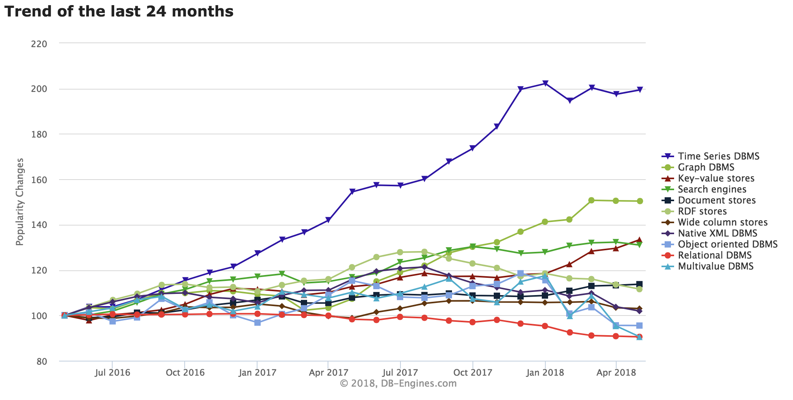

----

## Time Series database

  <!--  .element  height="40%"  width="40%"  -->

+ Scale
+ Usability

Note: 

Scale: Time-series data accumulates very quickly. (For example, a single connected car will collect 25GB of data per hour.) And normal databases are not designed to handle that scale: relational databases fare poorly with very large datasets; NoSQL databases fare better at scale, but can still be outperformed by a database fine-tuned for time-series data. In contrast, time-series databases (which can be based on relational or NoSQL databases) handle scale by introducing efficiencies that are only possible when you treat time as a first class citizen. These efficiencies result in performance improvements, including: higher ingest rates, faster queries at scale (although some support more queries than others), and better data compression.

Usability: TSDBs also typically include functions and operations common to time-series data analysis: data retention policies, continuous queries, flexible time aggregations, etc. Even if scale it not a concern at the moment (e.g., if you are just starting to collect data), these features can still provide a better user experience and make your life easier.

----

## Timeseries Database Ranking

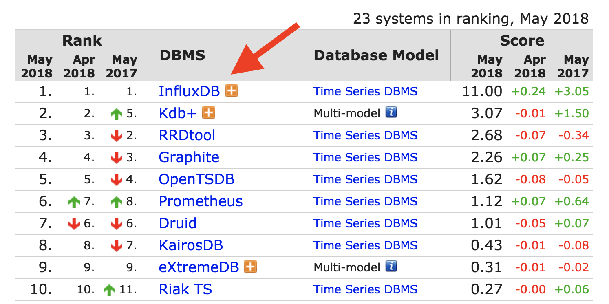

----

## InfluxData Products

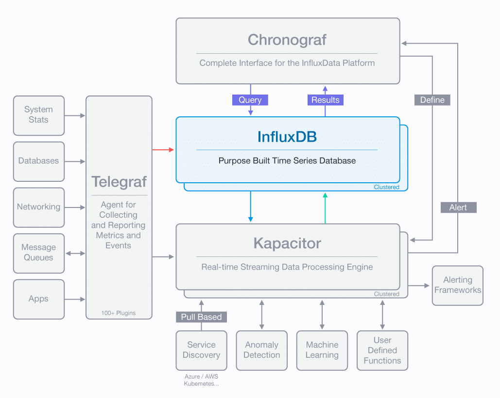 <!--  .element  height="60%" width="60%" -->

----

## Introducing

<div class="multiCol">
    <div class="col">
        <ul>
            <li>Open source</li>
            <li>Written in Go</li>
            <li>Easy to use</li>
            <li>Automated data retention policy</li>
        </ul>
    </div>
        <div class="col">
        <ul>
            <li>Schemaless</li>
            <li>Client libraries available</li>
            <li>Support for large amounts of data</li>
        </ul>
    </div>
</div>

  <!--  .element  height="30%"  width="40%" -->

----

## Data structure

+ **Measurement**, name of the measurement
+ **Tags**, metadata for the measurement
+ **Fields**, values for the measurement
+ **Timestamp**, primary index is always time

```
// example:

[measurement],[tags] [fields] [timestamp]

weather_sensor,crop=blueberries,region=north temp=50.1 1472515200000000000
weather_sensor,crop=blueberries,region=midwest temp=49.8 1472515200000000000
```

----

## Query Language

+ SQL Like
+ CLI & HTTP-Api for read and writes
+ Continuous Queries
+ Operators & Mathematical Functions
+ Automated data retention policies

```
// example:

SELECT MEAN("temp") FROM "weather_sensor" WHERE region = 'north'
```

----

## Data exploration

```sql
// GENERAL
SHOW DATABASES
SHOW SERIES
SHOW USERS

// SELECT
SELECT (*) FROM "wheather_sensor" GROUP BY region
SELECT (*) FROM "wheather_sensor" GROUP BY time(10m)
SELECT MEAN("temp") FROM "wheather_sensor" GROUP BY time(10m),region
SELECT MEAN("temp") FROM "wheather_sensor" GROUP BY time(10m),*
SELECT MEAN("temp") FROM "wheather_sensor" GROUP BY time(10m),* fill(none)

// INTO
SELECT MEAN("temp") INTO "grouped_data" FROM "wheather_sensor" GROUP BY time(10m)
```

----

## Writing data to InfluxDB
Manually using CLI or HTTP-API

```
INSERT weather_sensor,crop=blueberries,region=north temp=50.1
```
```
INSERT weather_sensor,crop=blueberries,region=north temp=50.1 1472515200000000000
```
or using client libraries  
(Python, Java, Go, Elixir, JavaScript, .Net, ...)

----

## InfluxDB Java Client

+ uses InfluxDB HTTP-API
+ Support batch operations
+ Write / Query
+ QueryResult mapper to POJO

```
influxDB.write(Point.measurement("cpu")
	.time(System.currentTimeMillis(), TimeUnit.MILLISECONDS)
	.addField("idle", 90L)
	.addField("user", 9L)
	.addField("system", 1L)
	.build());
```

```
Query query = new Query("SELECT idle FROM cpu", dbName);
```

----

## SpringBoot/Grails and InfluxDB

It is just as simple as adding dependencies on:

```
// file: build.gradle

compile "com.github.miwurster:spring-data-influxdb:1.6"
compile "org.influxdb:influxdb-java:2.9"
```

Result **DefaultInfluxDBTemplate** which can be configured using `application.yml`

----
## **Write** data
```
class InfluxDBWriterService {

    @Autowired
    DefaultInfluxDBTemplate defaultInfluxDBTemplate     // get the template

    def writeToInfluxDB(json) {
        Point point = Point.measurement("temperature")  // create a point
                .time(System.currentTimeMillis(), TimeUnit.MILLISECONDS)
                .tag("location", json.location)
                .addField("temperature", new Double(json.temperature))
                .build()


        defaultInfluxDBTemplate.write(point)            // write a point to InfluxDB
    }
}
```

----

## **Query** data to POJO

```
InfluxDBResultMapper resultMapper = new InfluxDBResultMapper(); // threadsafe
Query query = new Query("SELECT * FROM cpu", defaultInfluxDbTemplate.getDatabase())
QueryResult queryResult = influxDB.query(query)
List<Cpu> cpuList = resultMapper.toPOJO(queryResult, Cpu.class)
```
```
@Measurement(name = "cpu")
public class Cpu {
    @Column(name = "time")
    private Instant time;
    @Column(name = "host", tag = true)
    private String hostname;
    // some code ommitted intentionally
}
```

----

## Demo

##  **Insert data** using Grails/SpringBoot

---

# **Visualize the data** from your Things

Pretty pictures

----

## Visualization **options**


----

## Grafana Dashboard

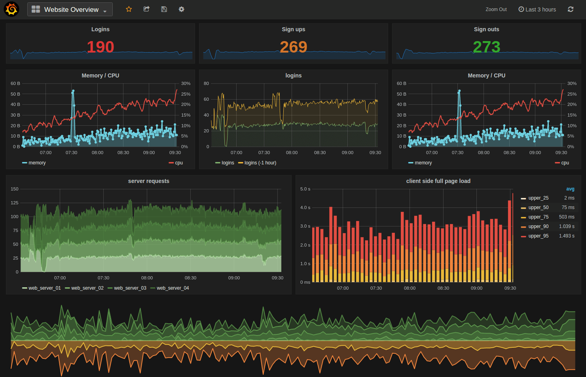 <!--  .element  height="80%"  width="80%" -->

----

## Demo

## Grafana - InfluxDB 

---

# Thank **you**